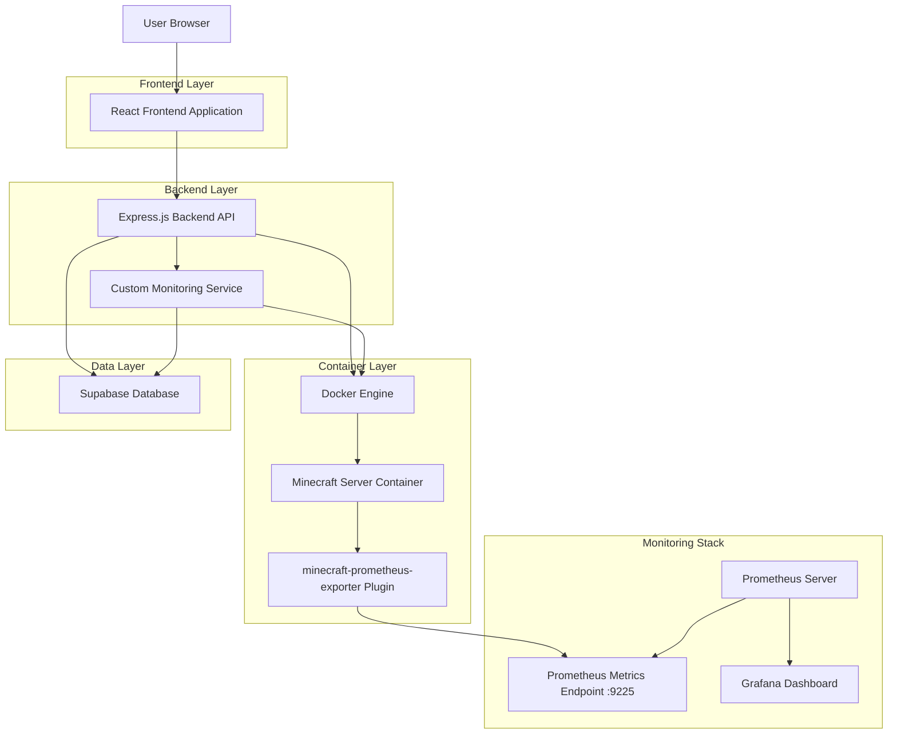
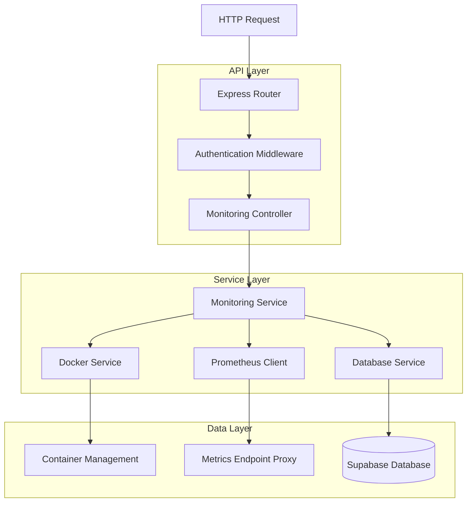
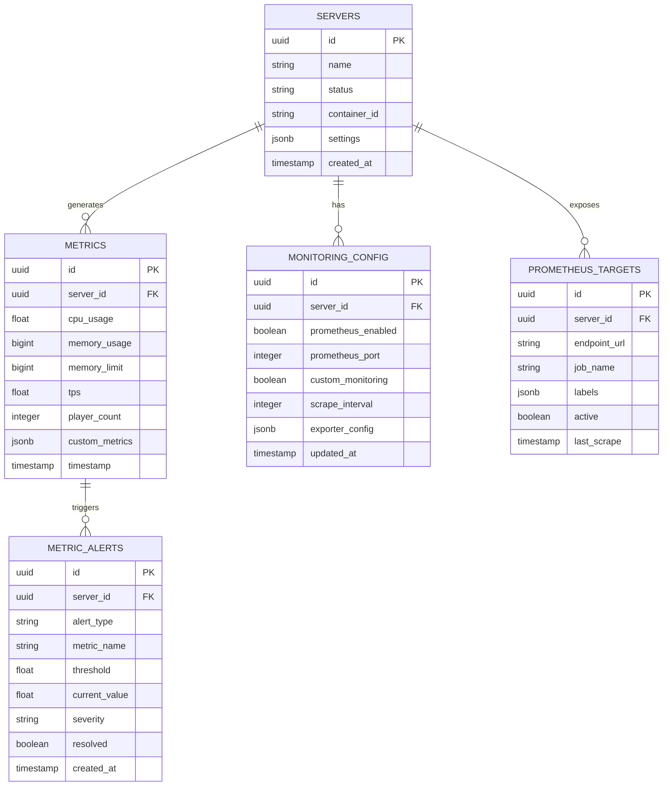
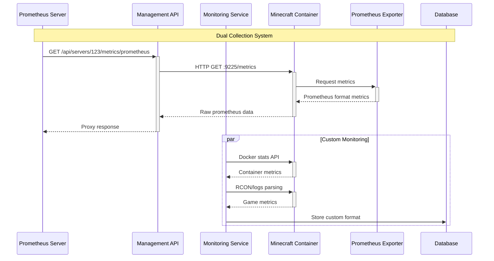

# Prometheus Integration Technical Architecture

## 1. Architecture Design



## 2. Technology Description

- Frontend: React@18 + tailwindcss@3 + vite
- Backend: Express@4 + TypeScript
- Database: Supabase (PostgreSQL)
- Container Runtime: Docker + dockerode
- Monitoring: minecraft-prometheus-exporter + Custom monitoring service
- Metrics Format: Prometheus text format
- Optional Stack: Prometheus + Grafana

## 3. Route Definitions

| Route                               | Purpose                                    |
| ----------------------------------- | ------------------------------------------ |
| /api/servers/:id/metrics/current    | Get current server metrics (custom format) |
| /api/servers/:id/metrics/historical | Get historical metrics from database       |
| /api/servers/:id/metrics/prometheus | Proxy to prometheus metrics endpoint       |
| /api/servers/:id/monitoring/start   | Start monitoring for a server              |
| /api/servers/:id/monitoring/stop    | Stop monitoring for a server               |
| /api/monitoring/alerts              | Get current alerts and thresholds          |

## 4. API Definitions

### 4.1 Core API

Prometheus metrics proxy

```
GET /api/servers/:serverId/metrics/prometheus
```

Response: Raw prometheus metrics in text format

```
# HELP minecraft_tps_gauge Current server TPS
# TYPE minecraft_tps_gauge gauge
minecraft_tps_gauge{server_id="abc123"} 20.0

# HELP minecraft_players_online Current online players
# TYPE minecraft_players_online gauge
minecraft_players_online{server_id="abc123"} 5
```

Monitoring configuration

```
POST /api/servers/:serverId/monitoring/configure
```

Request:
| Param Name | Param Type | isRequired | Description |
|------------|------------|------------|-------------|
| prometheus_enabled | boolean | false | Enable prometheus exporter |
| prometheus_port | number | false | Port for prometheus endpoint |
| custom_monitoring | boolean | false | Enable custom monitoring |
| scrape_interval | number | false | Metrics collection interval in seconds |

Response:
| Param Name | Param Type | Description |
|------------|------------|-------------|
| success | boolean | Configuration update status |
| config | object | Updated monitoring configuration |

Example Request:

```json
{
  "prometheus_enabled": true,
  "prometheus_port": 9225,
  "custom_monitoring": true,
  "scrape_interval": 30
}
```

## 5. Server Architecture Diagram



## 6. Data Model

### 6.1 Data Model Definition



### 6.2 Data Definition Language

Monitoring Configuration Table

```sql
-- Create monitoring_config table
CREATE TABLE monitoring_config (
    id UUID PRIMARY KEY DEFAULT gen_random_uuid(),
    server_id UUID NOT NULL REFERENCES servers(id) ON DELETE CASCADE,
    prometheus_enabled BOOLEAN DEFAULT false,
    prometheus_port INTEGER DEFAULT 9225,
    custom_monitoring BOOLEAN DEFAULT true,
    scrape_interval INTEGER DEFAULT 30,
    exporter_config JSONB DEFAULT '{}',
    created_at TIMESTAMP WITH TIME ZONE DEFAULT NOW(),
    updated_at TIMESTAMP WITH TIME ZONE DEFAULT NOW(),
    UNIQUE(server_id)
);

-- Create prometheus_targets table
CREATE TABLE prometheus_targets (
    id UUID PRIMARY KEY DEFAULT gen_random_uuid(),
    server_id UUID NOT NULL REFERENCES servers(id) ON DELETE CASCADE,
    endpoint_url VARCHAR(255) NOT NULL,
    job_name VARCHAR(100) DEFAULT 'minecraft-servers',
    labels JSONB DEFAULT '{}',
    active BOOLEAN DEFAULT true,
    last_scrape TIMESTAMP WITH TIME ZONE,
    created_at TIMESTAMP WITH TIME ZONE DEFAULT NOW(),
    UNIQUE(server_id)
);

-- Create metric_alerts table
CREATE TABLE metric_alerts (
    id UUID PRIMARY KEY DEFAULT gen_random_uuid(),
    server_id UUID NOT NULL REFERENCES servers(id) ON DELETE CASCADE,
    alert_type VARCHAR(50) NOT NULL,
    metric_name VARCHAR(100) NOT NULL,
    threshold FLOAT NOT NULL,
    current_value FLOAT NOT NULL,
    severity VARCHAR(20) DEFAULT 'warning' CHECK (severity IN ('info', 'warning', 'critical')),
    resolved BOOLEAN DEFAULT false,
    created_at TIMESTAMP WITH TIME ZONE DEFAULT NOW(),
    resolved_at TIMESTAMP WITH TIME ZONE
);

-- Create indexes
CREATE INDEX idx_monitoring_config_server_id ON monitoring_config(server_id);
CREATE INDEX idx_prometheus_targets_server_id ON prometheus_targets(server_id);
CREATE INDEX idx_prometheus_targets_active ON prometheus_targets(active);
CREATE INDEX idx_metric_alerts_server_id ON metric_alerts(server_id);
CREATE INDEX idx_metric_alerts_resolved ON metric_alerts(resolved);
CREATE INDEX idx_metric_alerts_severity ON metric_alerts(severity);

-- Grant permissions
GRANT SELECT ON monitoring_config TO anon;
GRANT ALL PRIVILEGES ON monitoring_config TO authenticated;
GRANT SELECT ON prometheus_targets TO anon;
GRANT ALL PRIVILEGES ON prometheus_targets TO authenticated;
GRANT SELECT ON metric_alerts TO anon;
GRANT ALL PRIVILEGES ON metric_alerts TO authenticated;

-- Insert default monitoring configurations
INSERT INTO monitoring_config (server_id, prometheus_enabled, custom_monitoring)
SELECT id, false, true FROM servers
WHERE id NOT IN (SELECT server_id FROM monitoring_config);
```

## 7. Integration Workflow

### 7.1 Server Creation with Prometheus Support

1. User creates new Minecraft server
2. System creates Docker container with minecraft-prometheus-exporter plugin
3. Plugin exposes metrics on port 9225 inside container
4. Container port is mapped to host (e.g., 9225:9225)
5. Prometheus target is registered in database
6. Custom monitoring service continues parallel data collection

### 7.2 Metrics Collection Flow



### 7.3 Configuration Management

- Monitoring configuration stored per server in database
- Dynamic enable/disable of prometheus exporter
- Port configuration and conflict resolution
- Graceful fallback to custom monitoring when prometheus unavailable
